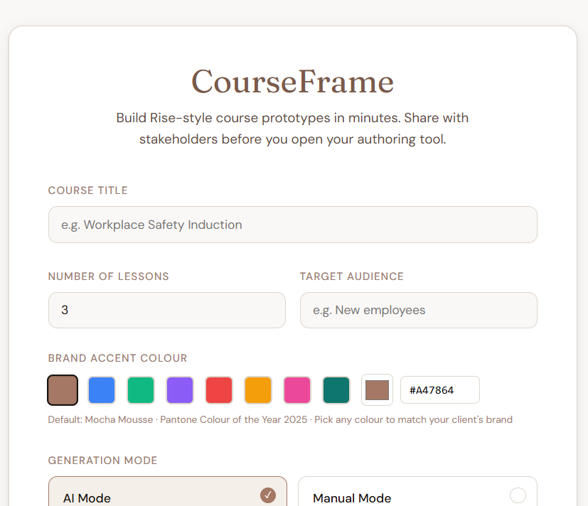

# 🖼️ CourseFrame

> **"Prototype first. Build second. Ship faster."**

[](LICENSE)
[](https://www.linkedin.com/sharing/share-offsite/?url=https://linuxsunil.github.io/courseframe/)
[](CONTRIBUTING.md)
[](https://linuxsunil.github.io/courseframe/)

CourseFrame is a free, open-source tool for instructional designers to build fully interactive, Rise 360-style course prototypes — in minutes, in the browser, with no authoring tool open.

Paste your raw SME notes. Pick your block types. Generate. Share a single HTML file with stakeholders before a single slide exists in Rise or Storyline.

**[🚀 Try CourseFrame live](https://linuxsunil.github.io/courseframe/)**

---

<p align="center">
  
</p>

---

## 💡 Why CourseFrame exists

Every instructional designer knows the pain:

*   **⏳ Time Sink:** You spend days building in Rise before stakeholders see anything.
*   **🛑 Expensive Changes:** Feedback comes late, and structural changes are expensive.
*   **📝 Misaligned Reviews:** SME reviews happen on finished content, not on the core structure.

CourseFrame flips the process. Get alignment on structure, content, and interactions **before** you open your authoring tool. Stakeholders click a real prototype — not a PDF, not a Figma mockup — and give feedback on something that feels like the real thing.

It's free. It always will be. Made for the global L&D community by someone who lives in it.

---

## ✨ What it does

| Feature | Detail |
| :--- | :--- |
| **🤖 AI Generation** | Paste raw content → AI writes all blocks |
| **🛠️ Manual Mode** | Build block by block, no API key needed |
| **🧩 11 Block Types** | Text, Callout, Image, Accordion, Tabs, Quiz, Process, Timeline, Sorting, Button, Divider |
| **✍️ Inline Editing** | Click any text in the preview to edit it live |
| **🎨 Brand Colours** | Pick any hex — the whole prototype updates |
| **📁 Single Export** | Downloads a single self-contained HTML file |
| **📦 Zero Install** | One HTML file. Opens in any browser. |
| **🔌 Provider Agnostic** | Works with Claude, GPT-4o, Gemini, or Copilot |

---

## 🏁 Getting started

### Option 1 — Use it online (Recommended) 🌐
**[https://linuxsunil.github.io/courseframe/](https://linuxsunil.github.io/courseframe/)**  
No download. No install. Just open and build.

### Option 2 — Run it locally 💻
```bash
git clone [https://github.com/linuxsunil/courseframe.git](https://github.com/linuxsunil/courseframe.git)
cd courseframe
open index.html
```

That's it. No npm. No build step. No dependencies.

### Option 3 — Download the file 📥

[Download index.html](https://github.com/linuxsunil/courseframe/raw/main/index.html) and open it in any browser.

---

## 🤖 Using AI mode

CourseFrame works with any major AI provider. You bring your own API key — it stays in your browser only, never sent anywhere except directly to your chosen provider.

| Provider | Where to get your key |
| :--- | :--- |
| **Anthropic Claude** | [console.anthropic.com](https://console.anthropic.com) |
| **OpenAI GPT-4o** | [platform.openai.com](https://platform.openai.com) |
| **Google Gemini** | [aistudio.google.com](https://aistudio.google.com) |
| **Microsoft Copilot** | [azure.microsoft.com](https://azure.microsoft.com/products/ai-services/openai-service) |

**No API key?** Use Manual mode to build every block yourself, or use the [manual prompt](docs/manual-prompt.txt) to generate content in any AI chat tool and paste the result back in.

---

## 🔄 The workflow

1.  **Setup** ⚙️: Set your course title, lessons, brand colour, and AI provider.
2.  **Build** 🔨: Paste raw SME notes per lesson to generate blocks with AI (or add manually).
3.  **Preview** 👀: Click through the full Rise-style prototype and edit text inline.
4.  **Export** 💾: Download a single, self-contained HTML file.
5.  **Share** 📤: Email it or upload to Drive. Stakeholders open it in any browser — no login needed.

---

## 🧩 Block types

| Block | What it does |
| :--- | :--- |
| **Text** | Paragraph content |
| **Callout** | Info, warning, success, or tip highlight box |
| **Image** | Placeholder with label for stakeholder reference |
| **Accordion** | Expandable Q&A pairs |
| **Tabs** | Tabbed content sections |
| **Quiz** | Multiple choice with branching feedback |
| **Process** | Numbered step-by-step flow |
| **Timeline** | Date-anchored event sequence |
| **Sorting** | Drag-and-drop categorisation activity |
| **Button** | CTA button, filled or outline style |
| **Divider** | Visual section separator |

---

## 📄 The exported file

The prototype you download is completely self-contained:

  * 🎨 All CSS embedded
  * ⚡ All interactivity in vanilla JavaScript
  * 🔗 No external dependencies
  * ✈️ Works offline, on a plane, in a client meeting
  * 📏 ~75–90kb total file size
  * 🌐 Opens in Chrome, Firefox, Safari, Edge

---

## 🗺️ Roadmap

  - [ ] 🌳 Scenario branching block
  - [ ] 🖱️ Drag-to-reorder blocks in preview
  - [ ] 🎭 Multiple export themes
  - [ ] 📦 SCORM metadata header option
  - [ ] 📂 Notion / Google Docs import
  - [ ] 🔗 Shareable link via GitHub Gist

---

## 🤝 Contributing

CourseFrame is built for the global L&D community. Contributions are welcome—whether that's a new block type, bug fix, or documentation. See [CONTRIBUTING.md](CONTRIBUTING.md) to get started.

---

## 📜 License

**MIT** — free to use, fork, modify, and share. See [LICENSE](LICENSE).

---

## 👨‍💻 Made by

**Sunil Kumar Iyer** — Instructional Designer & L&D Technologist

[LinkedIn](https://www.linkedin.com/in/sunil-iyer-b545964/) · [GitHub](https://github.com/linuxsunil)

*Built because the L&D community deserves better tools — and they should be free.*

---

## 📢 Share it

If CourseFrame saves you time, share it with a fellow ID. That's the only ask.

[](https://www.linkedin.com/sharing/share-offsite/?url=https://linuxsunil.github.io/courseframe/)